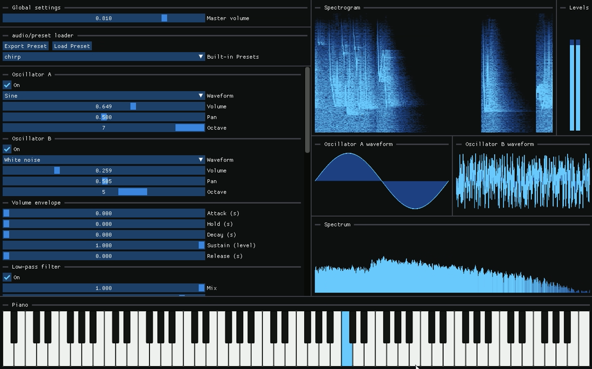

# Chirp 🎵
A cross-platform real-time modular synthesizer written in modern C++ with ImGui and PortAudio.




---

## About

**Chirp** started out as a small personal experiment. I wanted to see if I could synthesize bird sounds entirely from code.  
That idea sort of grew as I implemented modules such as oscillators, LFOs, filters, reverb, etc. I realized I could just turn it into a full modular audio engine instead.
The original “bird synthesis” experiment still lives on as one of the built-in presets, which is why the project kept its name: **Chirp**

This project is entirely built by me as a hobby and learning experience.  
It’s a way for me to explore and apply what I’ve learned about **digital signal processing (DSP)**, **modern C++** and **software architecture** in general.
At the same time, I wanted to challenge myself to create a **complete, cross-platform desktop application** with features like real-time DSP, GUI and build automation.

My goal has been to create something personal that combines my interests in music and programming.
Since 2020, I've been spending as much time on coding as I have on creating music, so a great deal of inspiration for this project has come from that part of my life.

---

## Features
- Oscillators that support generating sounds from a set of different waveforms  
- Volume and pan control  
- Envelopes to specify the "shape" of the sound, by modulating volume over time  
- Low-pass and high-pass filters to remove or highlight certain frequencies contained in the sound  
- Feedback delay for echo effect, with different modes of stereo separation  
- Reverb effect that simulates the reflections of sound in a physical space, adding a sense of depth and ambience  
- Custom modulation of different audio parameters for even more control and creativity  
- Customizable LFO/envelope shapes used as modulation sources  
- Spectrogram and spectrum visualizers that show the frequency content over time  
- Audio level bars that indicate loudness in both left and right audio channels  
- Waveform displays that show the currently selected waveforms and what the oscillators will in fact generate  
- A piano UI element that can be controlled via mouse or keyboard to play notes  
- Save and load presets so you can reuse sounds you have created  
- A set of built-in presets, including the "chirp" preset  

---

## Architecture
- Audio is routed through a graph, where each node processes or generates audio. The result from the root node is what is written to the audio buffer provided by PortAudio library (played to the default audio device).  
- Supports arbitrarily complex audio DAGs (directly acyclic graphs) which makes the audio engine completely modular. The synth is just a specific layout of an audio graph (a chain in this case: the audio is routed from top to bottom in the preset control window) but the system is flexible enough to support any configuration by deriving from the `AudioLayout` class.  
- GUI and audio engine runs on separate threads, allowing for responsive UI while also allowing the audio engine to generate audio in real-time without interruption.  
- A third thread is responsible for consuming the generated signal from the audio thread and computing the FFT of it. Then it passes the result to the GUI thread. I have implemented my own custom version of a bounded buffer (producer-consumer) synchronization construct for passing the audio signal between the audio and FFT threads. I'm not sure how much extra time it frees up for the audio thread in practice compared to computing the FFT directly, so it's mostly just an exercise in concurrency.  
- A modulation matrix is used for storing the connections between audio modulation sources and destinations. This allows for LFOs/envelopes to control audio parameters as explained previously, but in general supports any number of connections and in theory even nested modulations (though not supported in the UI yet).  
- Audio processing effects such as filters, feedback delay and reverb. These are implemented as nodes in the audio processing graph, which means they derive from `AudioProcessorNode`.  
- Oscillators derive from generators, which also derive from `AudioProcessorNode`. Generators represent `AudioProcessorNode`s that generate sound, rather than modify incoming sound. Currently, no other classes derive from `Generator`, but it's built this way to support for example sample players or microphone input in the future.  
- The way the user can change the preset and hear the difference in real-time is by using a set of `std::atomic's`. These atomics lie in a `AudioPreset` object, shared by both the GUI and audio threads. The GUI thread writes to these values on every frame and the audio thread reads them on every audio buffer callback.  
- The `AudioPreset` object is serialized to json in order to save presets. Likewise, a json file is deserialized to load a preset from disk.  
- The project was originally written for C++23 to be as modern as possible. However I realized during testing that all compilers didn't support some of the features yet. To keep the project more portable I decided to downgrade to C++20.

There are tons of other details I could go over, but these are some of the ones I find the most interesting.  
If you’re curious to explore further, feel free to dive into the source. It’s heavily commented and organized around these core ideas.

---

## Build Instructions

### Requirements
- CMake ≥ 3.15
- C++20 compiler
- Git

### Clone and build
```bash
git clone --recursive https://github.com/ludvig-sandh/Chirp.git
cd Chirp
cmake -B build -DCMAKE_BUILD_TYPE=Release
cmake --build build --config Release --parallel
```

> **Note:**  
> If CMake reports an error such as  
> `-- Building for: NMake Makefiles`  
> or  
> `CMAKE_CXX_COMPILER not set, after EnableLanguage`,  
> it means no compiler toolchain was detected automatically.  
> In that case, specify one explicitly when configuring:
>
> - **MSVC (Visual Studio)**  
>   ```bash
>   cmake -B build -G "Visual Studio 17 2022" -A x64 -DCMAKE_BUILD_TYPE=Release
>   ```
>
> - **MinGW (GCC)**  
>   ```bash
>   cmake -B build -G "MinGW Makefiles" -DCMAKE_BUILD_TYPE=Release
>   ```
>
> - **Ninja**  
>   ```bash
>   cmake -B build -G Ninja -DCMAKE_BUILD_TYPE=Release
>   ```
>
> Most Linux and macOS environments detect a compiler automatically,  
> but on Windows, CMake may default to **NMake**, which requires a Visual Studio Developer Prompt.

### Run without building

If you don’t want to compile Chirp yourself, you can also download a **prebuilt binary** directly from GitHub:

1. Go to the **[Actions](../../actions)** tab of this repository.  
2. Click the latest workflow run (with a green ✅ “Build” badge).  
3. Scroll down to the **Artifacts** section at the bottom.  
4. Download the ZIP file for your platform:
   - `chirp-windows-latest.zip`
   - `chirp-ubuntu-latest.zip`
   - `chirp-macos-latest.zip`
5. Extract it and run the executable (`chirp.exe` on Windows, `chirp` on Linux/macOS).

> **Note:** 
> These binaries are automatically built and tested on every commit using GitHub Actions,  
> so they’re always up to date with the latest source.

---

## Project Structure
```
src/                         # Source code
├── main.cpp                 # Program entry point
├── MainApplication.cpp/.hpp # Main application setup and control logic
│
├── audio/                   # Core audio synthesis and processing
│   ├── core/                # Fundamental DSP classes (waveform, pan, gain, frequency, etc.)
│   ├── effects/             # Audio effects (reverb, filters, etc.)
│   │   └── util/            # Low-level DSP building blocks used by effects
│   ├── engine/              # Audio engine and buffer management (PortAudio backend)
│   ├── generator/           # Sound generation nodes (oscillators, noise, etc.)
│   ├── layout/              # Application-specific audio graph layout and node management
│   ├── modulation/          # Modulation sources (LFOs, envelopes, modulation matrix)
│   └── preset/              # Preset serialization, saving/loading, and default configuration
│
├── fft/                     # FFT utilities and spectral analysis
├── gui/                     # ImGui-based user interface components
├── synchronization/         # Thread synchronization utilities
├── external/                # Third-party libraries
│
presets/                     # Default preset files bundled with the app
CMakeLists.txt               # Build configuration
README.md                    # Project overview and documentation

```

---

## License
This project is licensed under the **MIT License** — see the [LICENSE](LICENSE) file for details.

---

## Credits
Chirp makes use of the following open-source projects:
- [Dear ImGui](https://github.com/ocornut/imgui)
- [GLFW](https://github.com/glfw/glfw)
- [PortAudio](http://www.portaudio.com/)
- [ImGuiFileDialog](https://github.com/aiekick/ImGuiFileDialog)
- [PocketFFT](https://gitlab.mpcdf.mpg.de/mtr/pocketfft)

---

## Author
Created by **Ludvig Sandh**  
👉 [LinkedIn](https://www.linkedin.com/in/ludvig-sandh-550b32226/) • [GitHub](https://github.com/ludvig-sandh)